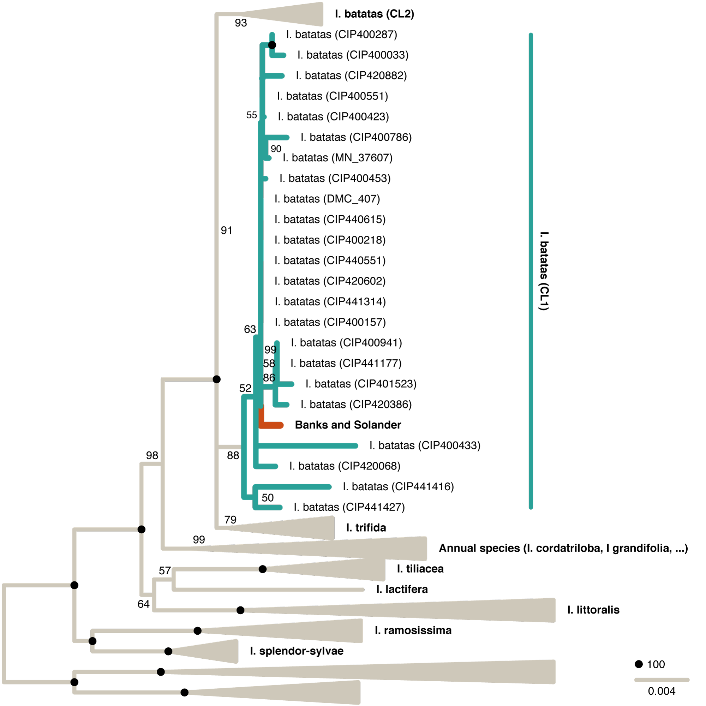
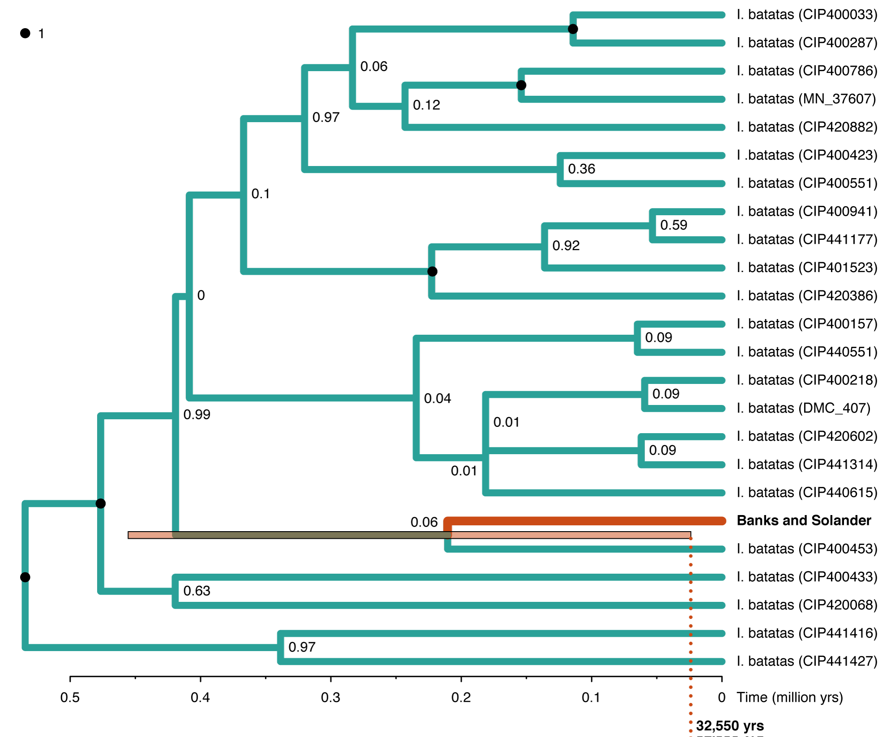
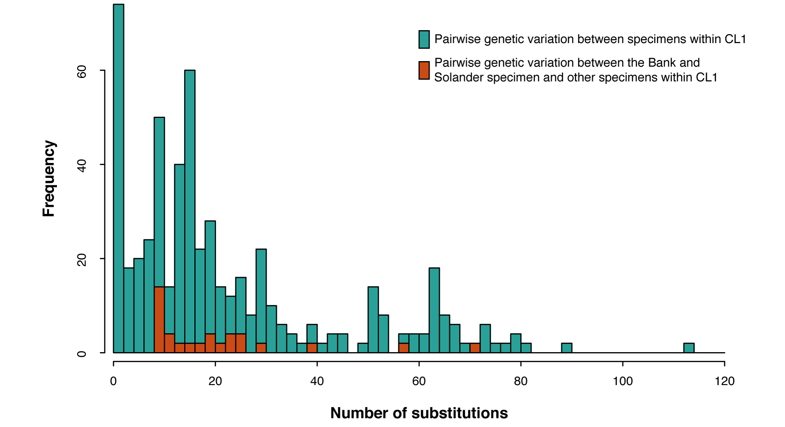
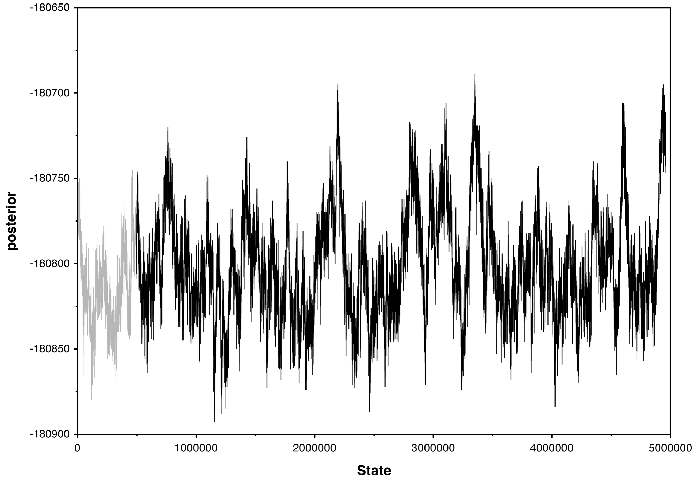

# Sweet potato dispersal or human transport?

### Summary

In a study that recently received widespread attention and was covered in [Nature News](https://www.nature.com/articles/d41586-018-04488-4), [New York Times](https://www.nytimes.com/2018/04/12/science/sweet-potato-pacific-dna.html), and [The Guardian](https://www.theguardian.com/science/2018/apr/12/tests-on-captain-cooks-sweet-potato-fuels-row-over-how-crop-reached-polynesia), [Muñoz-Rodríguez and colleagues](https://www.cell.com/current-biology/abstract/S0960-9822(18)30321-X) report on the DNA sequence of a sweet potato specimen sampled in Polynesia during Cook's expedition in 1769 and claim that it shows that the sweet potato colonized Polynesia long before humans. As I will show below, this claim is not supported by their results, and one could equally use these results to argue that all other sweet potato specimens sequenced by [Muñoz-Rodríguez et al. (2018)](https://www.cell.com/current-biology/abstract/S0960-9822(18)30321-X) arrived in the museum in which they are stored in pre-human times.

### Background

The sweet potato is potentially a very important piece in the puzzle of how and when humans migrated around the globe. A particularly controversial question is, and has long been, whether or not there was human contact between Pacific Islanders and South Americans before Columbus. As you may recall from history class, even the iconic [Kon-Tiki](https://en.wikipedia.org/wiki/Kon-Tiki_expedition) expedition of Thor Heyerdahl was motivated by this question and proved that sailing from South America to Polynesia would in principle have been possible with the technology available to Incas. There are many lines of evidence for pre-Columbian contact; however, most or all of them remain controversial. Some of these pieces of evidence were already available to Thor Heyerdahl, such as the similar masonry found on Easter Island and in Cusco, Peru, that could be a sign of a common origin but might also have been invented independently by both cultures ([Skinner 1955](http://www.jstor.org/stable/20703501?seq=1#page_scan_tab_contents)). Some other evidence was added more recently by DNA sequencing. For example, genome sequences of Easter Islanders were interpreted as supporting genetic admixture with Native Americans around 1280-1495 by [Moreno-Mayar et al. (2014)](https://www.cell.com/current-biology/abstract/S0960-9822(14)01220-2), but this interpretation was not supported by a more recent study based on ancient DNA sequences from Easter Island ([Fehren-Schmitz et al. 2017](https://www.cell.com/current-biology/abstract/S0960-9822(17)31194-6)). In addition, genome sequences extracted from bones of Brazilian Botocuda Indians that lived before 1800 clearly show that some of these Indians had Polynesian ancestry; however, European-mediated transport in the 18th century can not be ruled out as an explanation ([Malaspinas et al. 2014](https://www.cell.com/current-biology/abstract/S0960-9822%2814%2901274-3)). DNA from chicken bones excavated in Chile that date to 1321-1407 resembles that of Polynesian chickens which was taken as evidence that chickens were introduced to South America by Polynesians ([Storey et al. 2007](http://www.pnas.org/content/104/25/10335), [2012](http://journals.plos.org/plosone/article?id=10.1371/journal.pone.0039171)). These results were attributed to DNA contamination by [Thomson et al. (2014)](http://www.pnas.org/content/111/13/4826), but in turn the results of [Thomson et al. (2014)](http://www.pnas.org/content/111/13/4826), and thus their claim regarding DNA contamination were rejected as invalid due to methodological flaws by [Bryant (2014)](http://www.pnas.org/content/111/35/E3584) and [Storey & Matisoo-Smith (2014)](http://www.pnas.org/content/111/35/E3583).

Other strong evidence for pre-European contact between Polynesia and South America seemed to come from the sweet potato that natively occurs in the Americas but is also widely distributed on Polynesian Islands. Importantly, the plant has been reported from archeological sites in the Pacific that are around 1,000 years old; thus, it must have arrived there in pre-Columbian times ([Hather & Kirch 1991](https://www.cambridge.org/core/journals/antiquity/article/prehistoric-sweet-potato-ipomoea-batatas-from-mangaia-island-central-polynesia/4EE1E443CBCBFE19645D63C1E0FFD468)). Moreover, patterns of genetic variation of Polynesian sweet potato sampled from several islands support colonization from the direction of South America, more precisely from the region around Peru and Ecuador ([Rouiller et al. 2013](http://www.pnas.org/content/110/6/2205)). That humans were responsible for this import seems to be supported by the words used for sweet potato in the indigenous Quechua dialects of that region, "cumar" or "cumara", whereas the plant is called "kumara" or "kumala" in Polynesia; however, these terms might also have been introduced into Quechua dialects after the arrival of the Spanish in South America ([O'Brien 1972](https://www.jstor.org/stable/671520)). Nevertheless, the similarities in the cultivated plant as well as the words used for it have long been considered one of the strongest pieces of evidence for human contact between South America and Polynesia.

The study by [Muñoz-Rodríguez et al. (2018)](https://www.cell.com/current-biology/abstract/S0960-9822(18)30321-X) that was recently published in Current Biology now claims to provide support that the sweet potato dispersed to Polynesia thousands of years before humans lived there or in South America, which, if true, would definitely remove the sweet potato as a line of evidence for ancient human contact. However, the study by [Muñoz-Rodríguez et al. (2018)](https://www.cell.com/current-biology/abstract/S0960-9822(18)30321-X) does not contain evidence to support their claim.

### Analysis

The claim of [Muñoz-Rodríguez et al. (2018)](https://www.cell.com/current-biology/abstract/S0960-9822(18)30321-X) is based on phylogenetic divergence-time analyses of nuclear and chloroplast data of a large number of specimens of sweet potato and closely related species. Importantly, their data set includes sequence data of the sweet potato specimen sampled on the Society Islands by Joseph Banks and Daniel Solander, two members of Cook's expedition in 1769. [Muñoz-Rodríguez et al. (2018)](https://www.cell.com/current-biology/abstract/S0960-9822(18)30321-X) found that the "Banks and Solander" specimen appears to have separated from other specimens over 100,000 years ago (see their Figure 7b), which they use as their main argument for pre-human dispersal of sweet potato. This argument is fundamentally flawed as I will describe below.

Because not all details in [Muñoz-Rodríguez et al. (2018)](https://www.cell.com/current-biology/abstract/S0960-9822(18)30321-X) are described extensively, I reanalysed some of their data to ensure that I understand what they were doing. All scripts of my reanalysis are included in this repository to provide the transparency that I felt was incomplete in the original study.

So, this is what happened in [Muñoz-Rodríguez et al. (2018)](https://www.cell.com/current-biology/abstract/S0960-9822(18)30321-X), leading to their claim of sweet potato dispersal long before humans:

1. They sequenced and assembled chloroplast genomes, each about 150-180 kb, from 193 specimens of various species, including 72 specimens of the sweet potato (<i>Ipomoea batatas</i>). This data is provided by the authors at [https://ora.ox.ac.uk/objects/uuid:8a73cd2c-07f7-4509-9288-dd4a795b7e9c](https://ora.ox.ac.uk/objects/uuid:8a73cd2c-07f7-4509-9288-dd4a795b7e9c) (file `Chloroplast_sequences.zip`).
2. They aligned the chloroplast sequences with [MAFFT v7.271](https://mafft.cbrc.jp/alignment/software/) ([Katoh & Standley 2013](https://academic.oup.com/mbe/article/30/4/772/1073398)), using default settings. This step can be replicated with my script [`make_alignment.sh`](src/make_alignment.sh) if MAFFT is installed and the file `Chloroplast_sequences.zip` is placed in the [`data`](data) directory. The resulting alignment is 183,386 bp long.
3. They checked the alignment visually and made "minimal corrections" "in the poly-A and poly-T regions". I skipped this step in my reanalysis as I had no way to replicate it exactly and assumed that the "minimal corrections" were in fact minimal.
4. They used [Gblocks](http://molevol.cmima.csic.es/castresana/Gblocks.html) ([Casestrana 2000](https://academic.oup.com/mbe/article/17/4/540/1127654)) with default settings to remove poorly aligned regions. This step can be replicated with my script [`run_gblocks.sh`](src/run_gblocks.sh) if Gblocks is installed. The resulting alignment (here named [`chloroplast.aligned.gblocks.fasta`](res/align/chloroplast.aligned.gblocks.fasta)) is 126,596 bp long.
5. They generated a maximum-likelihood phylogeny of chloroplast sequences with [RAxML 8.0](https://sco.h-its.org/exelixis/web/software/raxml/index.html) ([Stamatakis 2014](https://academic.oup.com/bioinformatics/article/30/9/1312/238053)), assuming the GTR+G+I substitution model, and assessed node support with 1,000 bootstrap replicates. The alignment was not partitioned, so that the estimated parameters of the substitution model applied to each site of the alignment. This step can be replicated with my script [`run_raxml.sh`](src/run_raxml.sh) if RAxML is installed. The phylogeny resulting from my reanalysis is in file [`chloroplast.tre`](res/raxml/chloroplast.tre), shown in the figure below. This figure is equivalent to Figure S2 in the Supplemental Information of [Muñoz-Rodríguez et al. (2018)](https://www.cell.com/current-biology/abstract/S0960-9822(18)30321-X), but instead of expanding the clade of various annual species as they did, I expanded the CL1 clade (green) of sweet potato (<i>I. batatas</i>), the clade of interest that contains the Polynesian specimen sampled by Banks and Solander in 1769 (highlighted in orange). While not directly relevant for the question of dispersal, it is worth noting that the topology of the three clades <i>I. trifida</i>, <i>I. batatas</i> CL1, and <i>I. batatas</i> CL2 differs between my results and those of [Muñoz-Rodríguez et al. (2018)](https://www.cell.com/current-biology/abstract/S0960-9822(18)30321-X). In my reanalysis, the two <i>I. batatas</i> clades form a monophyletic group with 91% node support, whereas [Muñoz-Rodríguez et al. (2018)](https://www.cell.com/current-biology/abstract/S0960-9822(18)30321-X) claimed 100% support for a group combining <i>I. trifida</i> and <i>I. batatas</i> CL2 (see their Figure S2; I assume they misplaced the black dot indicating 100% support in this figure).

6. They performed "conventional divergence time estimation" with the Bayesian inference tool [RevBayes](http://revbayes.github.io) ([Hoehna et al. 2016](https://academic.oup.com/sysbio/article/65/4/726/1753608)), using a reduced data set containing only the specimens of the three clusters <i>I. trifida</i>, <i>I. batatas</i> CL1, and <i>I. batatas</i> CL2. In this analysis, they used again the GTR+G+I substitution model for the unpartitioned alignment, in combination with a birth-death branching model and an uncorrelated lognormal clock model. The clock was calibrated with a calibration on the root node (700,000 years +/- 180,000 years) according to the results of earlier divergence-time analyses without the Banks and Solander specimen (see their Figure 5). The authors report that they ran the RevBayes analysis for 500,000 Markov-chain Monte Carlo (MCMC) iterations. The resulting phylogeny 
is not shown in [Muñoz-Rodríguez et al. (2018)](https://www.cell.com/current-biology/abstract/S0960-9822(18)30321-X), but according to the caption of their Figure 7b, it supported a separation of the Banks and Solander specimen from other specimens at least 111,500 years ago. In order to replicate this analysis, some settings were required that were not provided in the paper, such as for priors and operators of the Bayesian algorithm. However, the authors shared their input file for their "coalescent analysis" with me (see next point), and I assumed in my reanalysis that priors and operators were consistent between the two analyses. The input file shared with me also indicates that instead of the 500,000 MCMC iteration reported in the paper, they actually used 5 million iterations. My input file for this RevBayes analysis is [`chloroplast.rev`](src/chloroplast.rev), and the script to replicate this analysis is [`run_revbayes.sh`](src/run_revbayes.sh). To run it, both RevBayes and TreeAnnotator (from the [BEAST2](https://www.beast2.org) package; [Bouckaert et al. 2014](http://journals.plos.org/ploscompbiol/article?id=10.1371/journal.pcbi.1003537)) must be installed. The summary tree resulting from my reanalysis is in file [`chloroplast.aligned.gblocks.subset.mcc.tre`](res/revbayes/chloroplast.aligned.gblocks.subset.mcc.tre) and shown in the figure below, which should be equivalent to Figure 7b of [Muñoz-Rodríguez et al. (2018)](https://www.cell.com/current-biology/abstract/S0960-9822(18)30321-X). Unlike in the original study, I included the Bayesian node support values in the figure which show that most nodes receive extremely low support, in line with the results of the RAxML analysis shown above. The topology also differs from that reported by [Muñoz-Rodríguez et al. (2018)](https://www.cell.com/current-biology/abstract/S0960-9822(18)30321-X), likely due to stochastic variation, in combination with poor stationarity of the MCMC analysis (see below). Notably, the minimum age estimate for the divergence of the Banks and Solander specimen is much younger than in the original study, 32,550 years instead of 111,500 years. Thus, I was unable to reproduce their age estimate.

7. They performed a "coalescent analysis" with RevBayes, using a model that allows "gene trees" (local phylogenies for a certain part of the genome) to be embedded in a species tree, which can potentially account for differences among gene trees due to incomplete lineage sorting. Other than that, the settings were apparently identical to the "conventional" RevBayes analysis described above, with the exception that they now used a strict molecular clock model instead of the uncorrelated molecular clock model that was used in the first analysis. Given that the authors shared their RevBayes input file for this analysis with me and the settings seemed clear to me, I did not try to replicate this analysis. The resulting phylogeny is shown in Figure 7b of [Muñoz-Rodríguez et al. (2018)](https://www.cell.com/current-biology/abstract/S0960-9822(18)30321-X), and appears to support of separation of the Banks and Solander specimen from other members of the CL1 clade at least 139,000 years ago.

These two results, those of the "conventional" and the "coalescent" analyses with RevBayes that support separation at least 111,500 or 139,000 years ago, are the primary basis for the authors' claim of sweet potato dispersal in pre-human times.

### So why is this wrong?

##### 1. There is nothing unusual about the chloroplast genome of the Banks and Solander specimen

As can clearly be seen from the above phylogenies, but also in Figure 7a of [Muñoz-Rodríguez et al. (2018)](https://www.cell.com/current-biology/abstract/S0960-9822(18)30321-X), the Banks and Solander specimen falls right within the diversity of other members of the CL1 clade of sweet potato. An analysis of pairwise genetic differences (with script [`get_pairwise_distance.sh`](src/get_pairwise_distance.sh)) shows that all across the aligned part (126,596 bp) of the chloroplast genome, it carries no more than 10 genetic differences to the most closely related specimens (these are the specimens CIP400157, CIP441314, CIP420602, DMC_407, CIP440615, CIP400218, and CIP440551). Plotting all pairwise distances among members of the CL1 clade (with script  [`plot_pairwise_distances.sh`](src/plot_pairwise_distances.sh)) produces the following figure, which again shows that the Banks and Solander specimen is completely inconspicuous in terms of its chloroplast genome.

From this plot it appears that the Banks and Solander specimen is simply a member of the population just like all other CL1 specimens. In fact, its mean genetic distance to other members of the group is even below average (21.5 compared to an average of 22.9 differences). Thus if this specimen is "separated", then most others are, too. Using the logic of [Muñoz-Rodríguez et al. (2018)](https://www.cell.com/current-biology/abstract/S0960-9822(18)30321-X), we can then argue that they must have dispersed in pre-human times to wherever they were sampled. Given that most were obtained from the International Potato Center (CIP) in Lima, Peru, we could argue that they must have been at that location for thousands of years, and possibly the Center was built around them. Thus, these ten differences can hardly be used to support the claim of dispersal in pre-human times.

##### 2. Divergence times for one marker are not dispersal times

What the authors really estimated in both of the above-mentioned RevBayes analyses are the times at which the chloroplast genomes diverged. Because the chloroplast genome does not usually recombine, the entire chloroplast genome effectively represents a single marker: each site of its sequence shares the same evolutionary history. However, this evolutionary history is nothing more than the history of the chloroplast genome. It may not match the evolutionary histories of the nuclear or the mitochondrial genomes (and due to recombination, fragments of the nuclear genome may have many different evolutionary histories), and it certainly does not represent the evolutionary history of the specimen (whatever that would even be supposed to mean).

Thus, instead of asking when the chloroplast genome of the Banks and Solander specimen diverged from other chloroplast genomes within the CL1 clade of sweet potato, the question that should have been asked to adress the question of sweet potato dispersal is: When was the last time that any part of the genome (chloroplast, nuclear, or mitochondrial) of the Solander and Banks specimen was shared with South American specimens? If one would find that all of this specimens' genomic information had been separated from that of South American specimens for many thousands of years, one could maybe claim to have evidence against human-mediated transport. Unfortunately, however, the chloroplast data of [Muñoz-Rodríguez et al. (2018)](https://www.cell.com/current-biology/abstract/S0960-9822(18)30321-X) (as well as the very limited nuclear sequence data that they generated) are unsuitable to address this question.

Notably, the "coalescent" RevBayes analysis (implementing the multi-species coalescent model) would have been able to address the question, but only if Polynesian and South American sweet potato had been defined as two separate species, and if the authors would have used the resulting species tree for interpretation rather than the gene tree. However, this is not what they did, and most certainly, sequences of more than one marker and more than one specimen for the Polynesian population would have been necessary for conclusive  results with this method.

##### Other potential issues in this study

<i>The whole timeline of sweet potato evolution may be overestimated.</i> In addition to the estimated divergence time for the Banks and Solander specimen, the authors also cite the age of a distantly related species (<i>I. tuboides</i>) as evidence that it must have dispersed to Hawaii, where it naturally occurs. The minimum age estimate for this divergence is 1.1 million years (see Figure 6 in [Muñoz-Rodríguez et al. 2018](https://www.cell.com/current-biology/abstract/S0960-9822(18)30321-X)), which in fact would clearly support natural dispersal if it was correct. However, this age estimate was based on analyses of concatenated nuclear data (thus not accounting for recombination among nuclear markers), a practice that is now well-known to lead to massive overestimation of divergence times, even on the order of a million years. This effect is explored and discussed in my own work together with Madlen Stange, Marcelo Sánchez, and Walter Salzburger ([Stange et al. 2018](https://academic.oup.com/sysbio/advance-article/doi/10.1093/sysbio/syy006/4827616)), just like in recent work by the BEAST2 developers ([Ogilvie et al. 2017](https://academic.oup.com/mbe/article/34/8/2101/3738283)).

<i>Analyses with RevBayes appear to be incomplete.</i> My replication of the "conventional" RevBayes analysis (see step 6 above) did not show sufficient signs of stationarity after 5 million MCMC iterations, the number of iterations that was probably also used by the authors (even though they reported in the paper that they used 500,000). The stationarity of MCMC analyses is commonly assessed by "effective sample size" (ESS) values for the different model parameters, and as a rule of thumb all of these ESS values should be above 200, otherwise the analysis is considered incomplete and estimates may be unreliable. In short, analyses with ESS values below 200 are not usually published. In my replication of the "conventional divergence time estimation" of [Muñoz-Rodríguez et al. (2018)](https://www.cell.com/current-biology/abstract/S0960-9822(18)30321-X), some of the ESS values are as low as 8, and even the ESS value for the posterior probability, arguably the most important ESS value to assess stationarity, is only 66. This indicates that these analyses should have been extended, ten-fold or more, before reporting on them in a manuscript. The incompleteness of the RevBayes analyses could explain the differences found between my reanalysis shown above and the original analysis shown in Figure 7b of [Muñoz-Rodríguez et al. (2018)](https://www.cell.com/current-biology/abstract/S0960-9822(18)30321-X). The image below shows the trace of the posterior probability, in which the strong autocorrelation between consecutive samples indicates that the posterior distribution has not been sampled sufficiently.

### Update

##### 28 April 2018

A [response](https://www.biorxiv.org/content/early/2018/04/27/309799), not to this reanalysis but to other criticism raised recently (e.g. [here](https://www.sciencemediacentre.co.nz/2018/04/13/when-did-sweet-potatoes-arrive-in-the-pacific-expert-reaction/)), has been posted on bioRxiv by three of the authors of [Muñoz-Rodríguez et al. (2018)](https://www.cell.com/current-biology/abstract/S0960-9822(18)30321-X).

In this response, the authors acknowledge that their nuclear sequences should not have been used for interpretation due to its low quality; however, the authors maintain the claim "that the chloroplast genome was distinct from other samples in our study and that, given our time-calibration, the Banks and Solander specimen diverged from other samples in our study outside of a timeframe for human domestication, more than 100,000 years ago." The authors further state "this does not mean the sweet potato was not transported to Polynesia by humans, but simply that the Banks and Solander specimen, along with other specimens in our study, had levels of genetic variation that placed them in a much older time-frame (Figure 1) compared with what would be expected if the tuber was a product of human domestication and if it were brought from America within the last 1,000 years." 

I disagree with the latter claim: If we would choose at random one of the other CL1 specimens and bring it to Polynesia right now, it would have a level of genetic variation absolutely comparable to that of the Banks and Solander specimen (as shown in the figures above). Thus, the level of genetic variation observed in the Banks and Solander specimen can not be used to argue for a much older time frame.

### Some comments on quotes in associated press articles

##### [Nature News: Sweet potato migrated to Polynesia thousands of years before people did](https://www.nature.com/articles/d41586-018-04488-4)

* <i>"Now, a study finds that the vegetable, which is native to South America, beat people to the South Pacific islands by at least 100,000 years."</i> — This claim is not supported by any evidence. Assuming the the divergence-time estimates of chloroplast genome sequences is unbiased, these chloroplast genomes separated that early, but this would be nothing more than a maximum age for the colonization of Polynesia. There is no evidence in this study that could be used for a minimum age of the colonization event. (Notably, based on my communication with Tom Carruthers, the second author on the paper, it seems that the authors didn't intend to interpret their results in this way. They argue that the divergence is older than 100,000 years, but only claim dispersal "thousands of years" before human colonization. Tom wrote: "we do not conclude that sweet potato has been in Polynesia for 100,000 years".)
* <i>"'This paper shows sweet potatoes were already in Polynesia when the islands were first colonized by humans thousands of years ago,' says Lars Fehren-Schmitz, a paleogeneticist at the University of California, Santa Cruz."</i> — No, it doesn't, as explained above.

##### [New York Times: All by itself, the humble sweet potato colonized the world](https://www.nytimes.com/2018/04/12/science/sweet-potato-pacific-dna.html)

* <i>"The Polynesian sweet potatoes turned out to be genetically unusual — 'very different from anything else,' Mr. Muñoz-Rodríguez said."</i> — This certainly does not apply to the chloroplast genome, as shown in the above figures or in Figure 7a of [Muñoz-Rodríguez et al. (2018)](https://www.cell.com/current-biology/abstract/S0960-9822(18)30321-X). In each of these figures, the Banks and Solander specimen appears nested among other specimens of the CL1 lineage, there is nothing unusual about it. The long branch in the phylogeny shown in Figure S7 of the Supplemental Information of the original study shows that something is odd about the nuclear data for the Banks and Solander specimen (it nevertheless appears nested among other CL1 specimens). But if the authors really only mapped 1,016 reads, as described in their Methods section, the quality of the nuclear data is more than questionable.

##### [The Guardian: Tests on Captain Cook's sweet potato fuel row over how crop reached Polynesia](https://www.theguardian.com/science/2018/apr/12/tests-on-captain-cooks-sweet-potato-fuels-row-over-how-crop-reached-polynesia)

* <i>"'It removes the last remaining potential evidence for contact,' said Prof Alan Cooper, director of the Australian Centre for Ancient DNA, who was not involved in the study.</i> — Again, it doesn't, and many would argue that it has never even been the last piece of evidence.

### Acknowledgements

I thank Tom Carruthers, the second author of [Muñoz-Rodríguez et al. (2018)](https://www.cell.com/current-biology/abstract/S0960-9822(18)30321-X) for discussing their results with me and for sharing the input file for the coalescent analysis with RevBayes. I also thank Dave Swofford, Bastiaan Star, and Lisa Matisoo-Smith for discussion.
